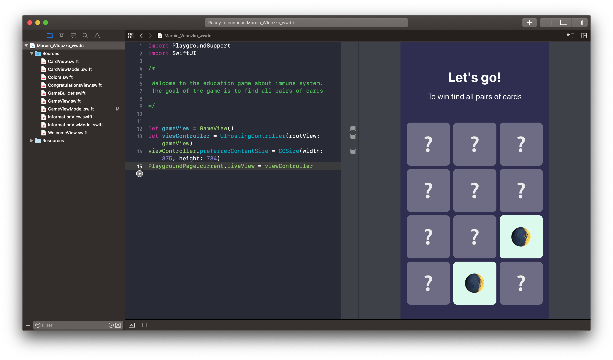

# WWDC-2020-Submission
My playground is an education game for kids that teach them about immunity system and how to improve it. During the game player is looking for pairs of cards with the same icon. If player will find a pair, game will give him some information about immunity system connected to the icon on card. The goal of game is to find all pairs.

